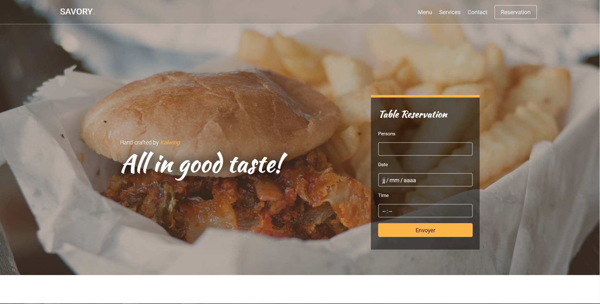
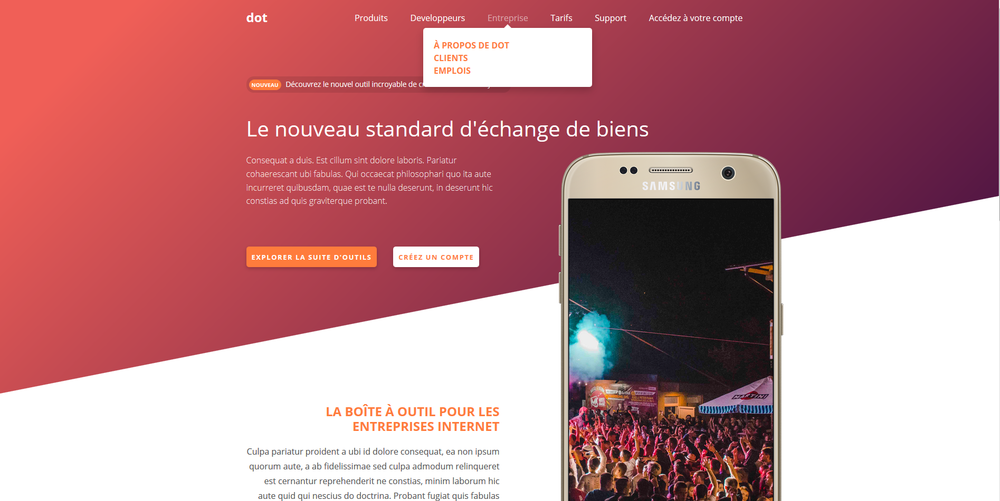
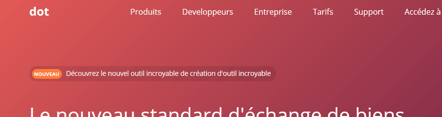
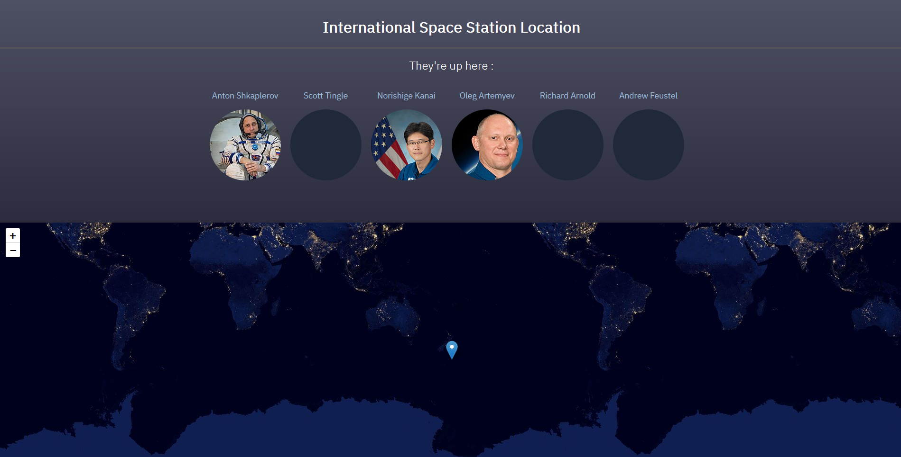
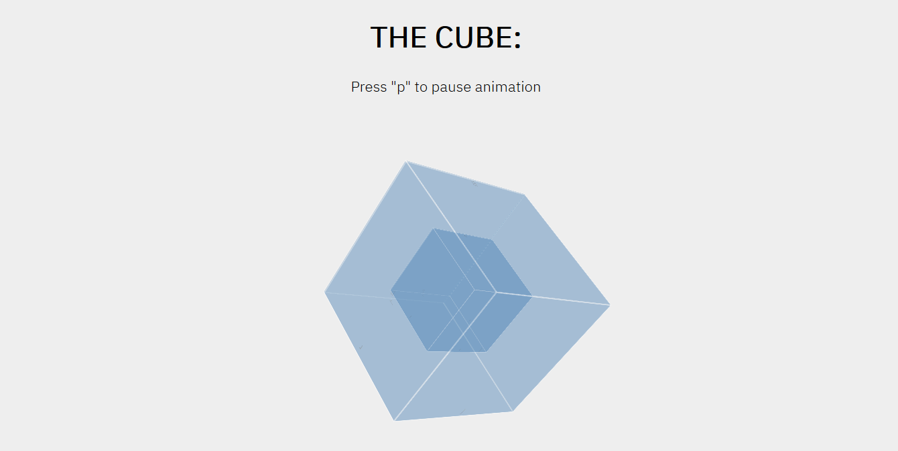
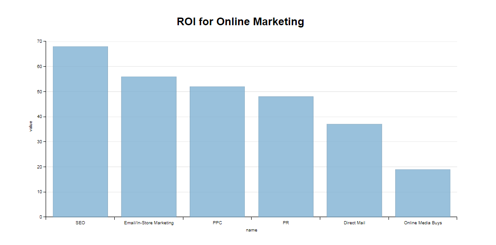

# job-ready-project
## A Bachelor In A Hurry
### Goals :

I started by doing The P1xt "[Get Job Ready - Python Edition](https://github.com/P1xt/p1xt-guides/blob/master/job-ready-python-edition.md)" cursus to improve my python skills. As I am doing an EECS bachelor (a "licence") in the University of Normandie, I also feel the need to add a more Electrical Engineering touch to it (In fact It should complete most requirements for the EECS bachelor at MIT). As I'm still unable to choose between a career as a data scientist, electrical engineer, industrial computer scientist, web developper and something transdisciplinary with medecine, this cursus should bring me a good enough basis in everything to choose my master accordingly.
I have less than a year. And I'm doing a real bachelor at the same time. And I have a job. It's totally unrealisable. But hey. I find it fun.

I reserve myself the right to skip a course if I have already mastered what's in it, as time is a limit.

You can find the "cursus" here : [Kalwing's programming cursus](cursus.md).

---
## Reviews :
<!---
The demos are here : [thomasdargent.com](http://thomasdargent.com/P1xt/demos_viewer/viewer.html)
-->
I'm updating my website so the demos aren't available currently.

### Tier 1 - Non-Python frontend necessities for Web Development

#### [Project : 1-Frontend1](Tier1-FrontEnd/1-Frontend1/)
*"Pick a template and implement the frontend of a website with it as your inspiration (do not use its assets)"*

Original template : **[Savory by GetTemplates.co](https://freehtml5.co/demos/savory/)**

**Demo : [Frontend1](http://thomasdargent.com/P1xt/1-Frontend1/index.html)**

#### [Course : 2-js_Edx](Tier1-FrontEnd/2-jsEdx/)
*"Programming for the Web with JavaScript"*

Content :
* **Homework 2 - Javascript** (petstore.js) :

Some simple function. *Graded: 100%*
* **Homework 3 - jQuery** (calc.js) :

Making a calculator with JQuery. Rushed a bit on this one. *Graded: 81%*

**Demo : [Calculator](http://thomasdargent.com/P1xt/2-js_Edx/calc.html)**

* **Homework 4 - React** (FontChooser.js) :

A UI to modify a text with React. First time using React and it was really fun. *Graded: 100%*
* **Homework 5 - React** (hW5/) :

A list app with React. Not easy, but really showed me the power of React. *Graded: 100%*

#### [Project: 3-Frontend2](Tier1-FrontEnd/3-Frontend2/)
*"Pick a template and implement the frontend of a website with it as your inspiration (do not use its assets)"*

Original website : **[Stripe](https://stripe.com/fr)**

**Demo : [Frontend 2](http://thomasdargent.com/P1xt/3-Frontend2/index.html)**

Since I couldn't find a template I really liked I decided to "copy" Stripe, As I really love their website.

I found a way to make a menu fully in CSS that used clip-path that I really liked :

#### [Project: 4-toddmotto_API_Frontend](Tier1-FrontEnd/4-toddmotto_API_Frontend/)
*"Select an API from Todd Motto's API List and build a frontend-only application powered by data fetched from the API you chose."*

API used :
* **[Open Notify](http://open-notify.org/Open-Notify-API/)**
* **[MediaWiki API](https://www.mediawiki.org/wiki/API:Main_page)**

**Demo : [ISS Localisation](http://thomasdargent.com/P1xt/4-toddmotto_API_Frontend/index.html)**

The usage of the Open Notify one was very straightforward, as they gave everything with great example. The wikimedia one was harder, in the end I couldn't not get more than 3 pictures.. I also wanted to add an emoji with the nationality of the person pictured, but couldn't
find the property.

#### [Course : 5-Advanced_HTML_CSS](Tier1-FrontEnd/5-Advanced_HTML_CSS/)
*"Learn to Code Advanced HTML & CSS"*

Content :
* [**Performance & Organization**](Tier1-FrontEnd/5-Advanced_HTML_CSS/lesson1.md) :

   Heavy emphasis on *OOCSS*, It might be better than my weird version of *BEM*, but seems to be a bit much for small websites.

* [**Detailed Positioning**](Tier1-FrontEnd/5-Advanced_HTML_CSS/lesson2.md) :

   Not much that is new to me here. Still learned of a way to have a better compatibility for the Clearfix.

* [**Complex Selectors**](Tier1-FrontEnd/5-Advanced_HTML_CSS/lesson3.md) :

   LOTS of selector that I didn't or vaguely knew. I especially love the Attributes selector.

* [**Responsive Web Design**](Tier1-FrontEnd/5-Advanced_HTML_CSS/lesson4.md) :

   Cool fix for responsive iframe. Learned about the viewport tag
   and Mobile First Web Design.

* [**Preprocessors**](Tier1-FrontEnd/5-Advanced_HTML_CSS/lesson5.md) :

   Always feared to learn those. I don't really like haml.. But SASS/SCSS looks
   awesome. I'll try it on my next project I think.

* [**Transforms**](Tier1-FrontEnd/5-Advanced_HTML_CSS/lesson7.md) :

   Learned about some interesting 3D property. I made an ["hypercube"](Tier1-FrontEnd/5-Advanced_HTML_CSS/Test/cube.html) to test those. **[Demo's here](http://thomasdargent.com/P1xt/5-Advanced_HTML_CSS/Test/cube.html)**
    :
* [**Transitions & Animations**](Tier1-FrontEnd/5-Advanced_HTML_CSS/lesson8.md) :
   Good reminder about animation

* [**Extending Semantics & Accessibility**](Tier1-FrontEnd/5-Advanced_HTML_CSS/lesson10.md) :
   Learned about a lot of tags. And about microdata and WAI-ARIA

#### [Course : 6-D3js](Tier1-FrontEnd/6-D3js/)
*"Data Visualization and D3.js"*

Content :
* [**Note on design**](Tier1-FrontEnd/6-D3js/note_design.md) :

   The most important thing I learned regarding to Design in this course.

* [**Note on Code**](Tier1-FrontEnd/6-D3js/note_code.md) :

   The most important thing I learned regarding to Programming, and making chart
on the web, in this course.

* [**Project 2**](Tier1-FrontEnd/6-D3js/Project/Mini_Project2) : A redesign of [this chart](http://www.designyourway.net/diverse/2/wronginfo/60373947977.jpg) with dimple.js.
   [**Demo's here**](http://thomasdargent.com/P1xt/6-D3js/Project/Mini_Project2/index.html)

   

I forgot to take note of the first sections. Might have to add that later.

### Tier 2-Python Basics:

####  Challenge: Python on HackerRank
I was already doing the main python course of HackerRank, and found that doing the Python interview prep took a lot of time (mostly because of the number of exercises); So I chose to keep doing the main one.

**Progress:** 45% (profile accessible here: [HackerRank](https://www.hackerrank.com/thomasdargent))

#### Study: the django documentation
Done, and had an internship based heavily on django

#### Project: participate in one [Bot Programming](https://www.codingame.com/multiplayer/bot-programming) competition.~~

### Tier 3 - More Python, Basic CS and Electronics

#### [Project: Easy through hard CodinGame Challenge](Tier3-More_Python/1-CodinGame)

* **Easy:** *Done.*
  * Power of Thor
  * Mime Type
  * Horse Racing Duals
  * Chuck Norris
  * Defibrillators
  * Temperatures
  * MarsLander
  * Ascii Art
  * Onboarding
  * The Descent
* **Medium:** *In Progress.*
  * Shadows of the Knight 1
  * There is no Spoon 1

#### [Course: Introduction to Computational Thinking and Data Science](Tier3-More_Python/2-Introduction_Computational_Thinking)

* **Unit 1**:
[pset1](Tier3-More_Python/2-Introduction_Computational_Thinking/pset1): Done.
* **Unit 2**:
[pset2](Tier3-More_Python/2-Introduction_Computational_Thinking/pset2): Done.
* **Quizz**: Done. I got a 87%.
* **Unit 3**: [exercises and pset3](Tier3-More_Python/2-Introduction_Computational_Thinking/unit3): Done.
* **Unit 4**: Done.
* **Final**: Done. I got 92%.
Total : Got 94%. (So an A I think ?)

#### [Course: 6.01 - Introduction to EECS](Tier3-More_Python/3-Introduction_To_EECS)

I can't get the library to work so I can't do the design exercises.
* **Unit 1**:
    * [OOP](Tier3-More_Python/3-Introduction_To_EEC/Unit_1/oop): Skipped somethings, but I think I'll be ok ! :stuck_out_tongue_winking_eye:
    * [State Machine](Tier3-More_Python/3-Introduction_To_EEC/Unit_1/state_machine): Done.
* **Unit 2**:
    * [Signals and systems](Tier3-More_Python/3-Introduction_To_EEC/Unit_2/signals_and_systems): Done up to **Soft. Lab. 4**.

#### [Course: Introduction to Machine Learning](Tier3-More_Python/9-Intro_to_ML)
Done. Really good course albeit sometime long on the "easy" stuff and fast on the math etc... at least for me.

## Contact :

So I made this to learn, while there's some issues that I have already spotted and will fix upon the completion of the course, I would love to hear your thoughts. Bad ones or good ones, anything that could help my learning.

Feel free to reach out here or on twitter : **@dargent_t**
