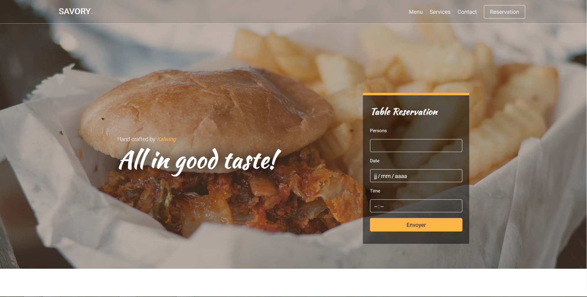
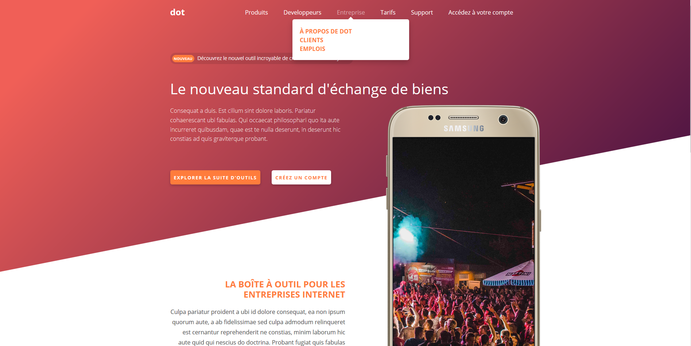
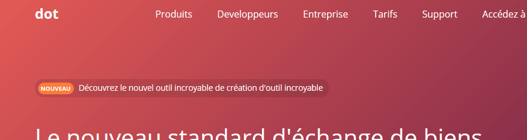

# python-project
## Projects made for P1xt's "Get Job Ready - Python Edition"

I learned some Python in class, mostly to do signal analysis wiuth NumPy,
and I wanted to improve my skills further. I appeared to me that learning Django
could be a fun way to to do that as it's been a long time since I've done
BackEnd dev. I already have some background in FrontEnd Developpement, but
thought that it couldn't do me harm to learn more Js.

So here you'll find most of what I've done for this course.
You can find the "curriculum" here : [Get Job Ready - Python Edition](https://github.com/P1xt/p1xt-guides/blob/master/job-ready-python-edition.md)

## Tier 1 - Non-Python frontend necessities for Web Development

### [Project : 1-Frontend1](1- Frontend1/)
*"Pick a template and implement the frontend of a website with it as your inspiration (do not use its assets)"*

Original template : **[Savory by GetTemplates.co](https://freehtml5.co/demos/savory/)**

### [Course : 2-js_Edx](2- js Edx/)
*"Course - Programming for the Web with JavaScript"*

Content :
* **Homework 2 - Javascript** (petstore.js) :

Some simple function. *Graded: 100%*
* **Homework 3 - jQuery** (calc.js) :

Making a calculator with JQuery. Rushed a bit on this one. *Graded: 81%*
* **Homework 4 - React** (FontChooser.js) :

A UI to modify a text with React. First time using React and it was really fun. *Graded: 100%*
* **Homework 5 - React** (hW5/) :

A list app with React. Not easy, but really showed me the power of React. *Graded: 100%*

### [Project: 3-Frontend2](3-Frontend2/)
*"Pick a template and implement the frontend of a website with it as your inspiration (do not use its assets)"*

Original website : **[Stripe](https://stripe.com/fr)**

As I couldn't find a template I really liked I decided to "copy" Stripe, As I really love their website.

I found a way to make a menu fully in CSS that used clip-path that I really liked :

### [Project: 4-toddmotto_API_Frontend](4-toddmotto_API_Frontend/) ***CURRENT ONE***
*"Select an API from Todd Motto's API List and build a frontend-only application powered by data fetched from the API you chose."*

API used :
* **[Open Notify](http://open-notify.org/Open-Notify-API/)**
*   **[MediaWiki API](https://www.mediawiki.org/wiki/API:Main_page)**

The usage of the Open Notify one was very straightforward, as they gave everything with great example. The wikimedia one was harder, in the end I couldn't not get more than 3 pictures.. I'll dig a bit later. I would also like to add an emoji with the nationality of the person pictured.

## Contact :

So I made this to learn, while there's some issues that I have already spotted and will fix upon the completion of the course, I would love to hear your thoughts. Bad ones or good ones, anything that could help my learning.

Feel free to reach out here or on twitter : **@dargent_t**
